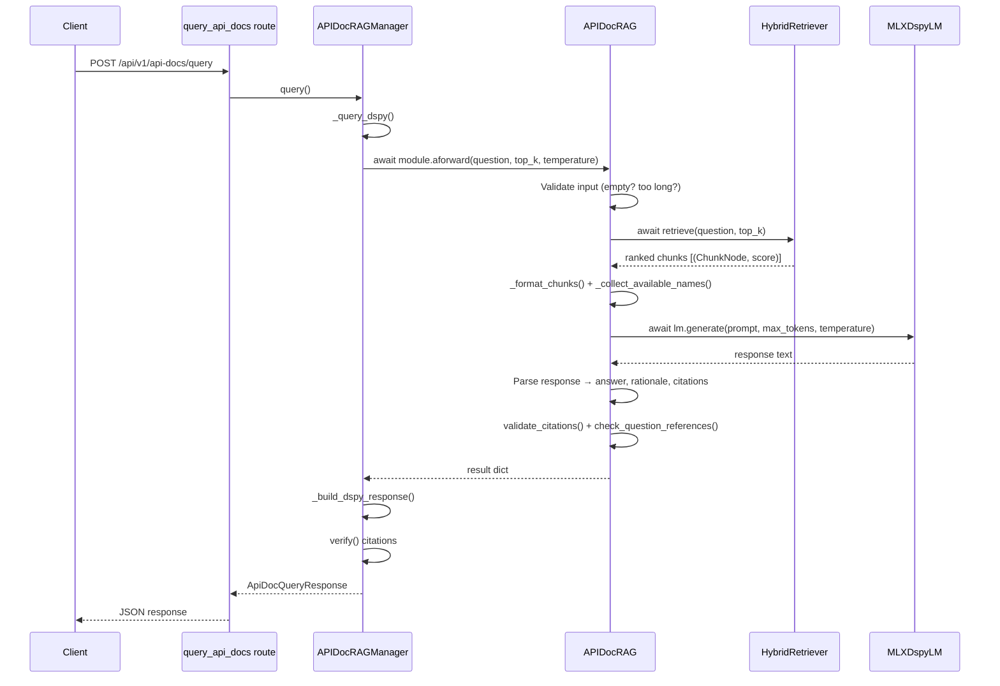
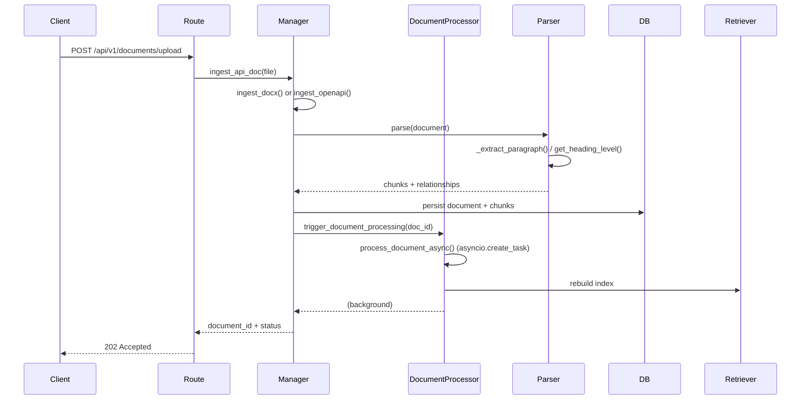

# rag-pipeline Architecture

> Generated from GitNexus knowledge graph — 9693 indexed symbols, 15325 edges, 208 functional areas, 193 execution flows.

## Overview

rag-pipeline is a **Retrieval-Augmented Generation (RAG) API documentation system**. It ingests structured API documentation (OpenAPI specs, docx files), chunks it into graph-structured nodes (interfaces, enums, error codes, records), and answers natural-language queries using a hybrid BM25+FAISS retriever with DSPy-powered reasoning.

The system exposes a **FastAPI backend** with JWT authentication and a **Streamlit frontend**, supporting three RAG backends: cosine-similarity (default), LangChain (BM25+FAISS hybrid), and LlamaIndex. A dedicated **api_docs pipeline** provides DSPy-driven chain-of-thought reasoning over API documentation chunks.

---

## Project Structure

```
rag-pipeline/
├── src/
│   ├── main.py                          # Entrypoint: imports app, runs uvicorn
│   ├── api/                             # FastAPI layer
│   │   ├── main.py                      # App factory, middleware, CORS
│   │   ├── routes/                      # Route modules (auth, documents, query, ...)
│   │   ├── dependencies.py              # Route-level deps (get_current_user, etc.)
│   │   └── schemas/                     # Pydantic request/response models
│   ├── core/                            # Cross-cutting concerns
│   │   ├── config.py                    # Settings from env (pydantic-settings)
│   │   ├── security.py                  # JWT/bcrypt auth primitives
│   │   ├── logging.py                   # Logging configuration
│   │   └── exceptions.py               # Custom exception hierarchy
│   ├── domain/                          # Business logic
│   │   ├── entities/                    # Core domain models (Document, Chunk, etc.)
│   │   ├── ports/                       # Repository interfaces (ports)
│   │   ├── services/                    # Domain services
│   │   │   ├── embedding.py            # Embedding service (singleton)
│   │   │   ├── llm.py                  # LLM service (singleton, lazy-loaded)
│   │   │   ├── retrieval_langchain.py  # BM25+FAISS hybrid retriever
│   │   │   ├── retrieval_llamaindex.py # LlamaIndex retriever
│   │   │   ├── processor.py            # Async document processing
│   │   │   ├── verification.py         # Citation/response verification
│   │   │   └── prompt_builder.py       # Prompt template assembly
│   │   └── rag/
│   │       └── api_docs/               # DSPy-powered API doc RAG pipeline
│   │           ├── manager.py          # Orchestrator (circuit breaker, fallback)
│   │           ├── routes.py           # API doc query routes
│   │           ├── chunking/           # Graph-based chunking (ChunkGraph, ChunkNode)
│   │           ├── extraction/         # Document extraction (OpenAPI, docx)
│   │           ├── pipeline/           # DSPy pipeline (module, lm_adapter)
│   │           └── retrieval/          # Hybrid retriever for api_docs
│   └── infrastructure/                 # I/O adapters
│       ├── database/                   # SQLAlchemy models + aiosqlite
│       ├── parsers/                    # Document parsers (OpenAPI, base)
│       ├── embedding/                  # Embedding infrastructure
│       ├── llm/                        # LLM infrastructure (MLX)
│       └── strategies/                 # Chunking strategy config (YAML)
├── client/
│   └── app.py                          # Streamlit frontend
├── tests/
│   ├── unit/                           # Unit tests (pytest asyncio)
│   ├── integration/                    # Integration tests (ASGITransport)
│   ├── frontend/                       # Frontend/UI tests
│   └── docs/                           # Test fixture documents
├── config/
│   ├── strategies.yaml                 # Chunking strategy definitions
│   └── ...
├── data/
│   └── vectorstore/                    # FAISS index persistence
├── scripts/                            # Dev scripts (run, profile, stop)
└── .opencode/                          # Agent configuration
```

---

## Architecture Diagram (Layered)

```
┌──────────────────────────────────────────────────────────────────┐
│                    Streamlit Frontend (client/app.py)             │
│                    Port 8501                                     │
└──────────────────────────┬───────────────────────────────────────┘
                           │ HTTP (JSON)
┌──────────────────────────▼───────────────────────────────────────┐
│                   FastAPI Backend (src/api/main.py)               │
│                   Port 8000                                      │
│                                                                   │
│  ┌──────────────┬──────────────┬──────────────┬──────────────┐   │
│  │ Auth Routes  │ Doc Routes   │ Query Routes │ Debug Routes │   │
│  │ /api/v1/auth │ /api/v1/doc/ │ /api/v1/query│ /api/v1/debug│   │
│  └──────┬───────┴──────┬───────┴──────┬───────┴──────┬───────┘   │
│         │              │              │              │           │
│  ┌──────▼──────────────▼──────────────▼──────────────▼───────┐   │
│  │                   Dependencies Layer                       │   │
│  │     get_current_user, get_db, get_query_service            │   │
│  └──────────────────────────┬────────────────────────────────┘   │
└─────────────────────────────┬────────────────────────────────────┘
                              │
┌─────────────────────────────▼────────────────────────────────────┐
│                       Domain Layer                               │
│                                                                   │
│  ┌─────────────────────────────────────────────────────────┐     │
│  │                 RAG Query Dispatcher                      │     │
│  │    ┌──────────────┐  ┌──────────────┐  ┌────────────┐   │     │
│  │    │ DSPy Pipeline │  │ LangChain    │  │ LlamaIndex │   │     │
│  │    │ (api_docs/)   │  │ Retriever    │  │ Retriever  │   │     │
│  │    └──────┬───────┘  └──────────────┘  └────────────┘   │     │
│  └───────────┼─────────────────────────────────────────────┘     │
│              │                                                    │
│  ┌───────────▼─────────────────────────────────────────────┐     │
│  │              Domain Services                             │     │
│  │  embedding.py │ llm.py │ processor.py │ verification.py │     │
│  └─────────────────────────────────────────────────────────┘     │
└─────────────────────────────┬────────────────────────────────────┘
                              │
┌─────────────────────────────▼────────────────────────────────────┐
│                   Infrastructure Layer                            │
│                                                                   │
│  ┌──────────────┐  ┌──────────────┐  ┌──────────────────────┐   │
│  │  SQLAlchemy   │  │  FAISS       │  │  MLX / HF Models    │   │
│  │  + aiosqlite  │  │  Vectorstore │  │  (LLM + Embedding)  │   │
│  └──────────────┘  └──────────────┘  └──────────────────────┘   │
│                                                                   │
│  ┌──────────────┐  ┌──────────────┐  ┌──────────────────────┐   │
│  │  Document    │  │  Chunking    │  │  Strategy Config     │   │
│  │  Parsers     │  │  Strategies  │  │  (YAML)              │   │
│  └──────────────┘  └──────────────┘  └──────────────────────┘   │
└──────────────────────────────────────────────────────────────────┘
```

---

## API Layer (`src/api/`)

### Routes (all under `/api/v1` prefix)

| Route Group | Endpoints | Auth |
|-------------|-----------|------|
| **Auth** | `POST /auth/token` (login), `POST /auth/refresh` | None / Bearer |
| **Documents** | `GET /documents/`, `POST /documents/upload`, `GET /documents/{id}`, `DELETE /documents/{id}`, `POST /documents/{id}/reprocess` | JWT |
| **Query** | `POST /query` (documents), `POST /query/stream` (SSE stream), query routes for each backend variant | JWT |
| **API Docs** | `GET /api-docs/strategies/types`, `POST /api-docs/ingest`, `POST /api-docs/query` | JWT* |
| **Health** | `GET /health`, `GET /health/ready` | None |
| **Debug** | Various debug endpoints | JWT |

>  `GET /api/v1/documents/strategies/types` is the only unauthenticated route besides auth and health.

### Middleware
- CORS (configured via `CORS_SETTINGS`)
- JWT validation via `get_current_user` dependency
- Request logging

### Entrypoint
`src/main.py` imports the `app` from `src.api.main` and runs uvicorn:
```python
# src/main.py
from src.api.main import app
# uvicorn.run(app, ...)
```

---

## Domain Layer (`src/domain/`)

### Core Domain Services

| Service | File | Responsibility |
|---------|------|---------------|
| `EmbeddingService` | `services/embedding.py` | Singleton, lazy-loaded sentence-transformer embedder |
| `LLMService` | `services/llm.py` | Singleton, lazy-loaded MLX LLM |
| `HybridRetriever` | `services/retrieval_langchain.py` | BM25 + FAISS ensemble retrieval |
| `LlamaIndexRetriever` | `services/retrieval_llamaindex.py` | LlamaIndex-based retrieval |
| `DocumentProcessor` | `services/processor.py` | Async background document processing via `asyncio.create_task` |
| `VerificationService` | `services/verification.py` | Citation and response validation |
| `PromptBuilder` | `services/prompt_builder.py` | Prompt template assembly |

### DSPy RAG Pipeline (`src/domain/rag/api_docs/`)

The most complex subsystem — a graph-based API documentation ingestion and RAG query pipeline using [DSPy](https://github.com/stanfordnlp/dspy) for structured reasoning.

#### Pipeline Components

```
                   ┌──────────────────────────────┐
                   │       APIDocRAGManager        │
                   │        (manager.py)           │
                   │                                │
                   │  _query_dspy()                 │
                   │  _query_fallback()             │
                   │  _build_dspy_response()        │
                   │  circuit_breaker               │
                   └──────────┬───────────────────┘
                              │ aforward()
              ┌───────────────▼───────────────────┐
              │         APIDocRAG Module           │
              │          (module.py)               │
              │                                    │
              │  forward() / aforward()            │
              │  _forward_impl() / _aforward_impl()│
              │  _generate_with_assertions()       │
              │  _generate_fallback()              │
              │                                    │
              │  response_generator (ChainOfThought)│
              │  fallback_generator (Predict)      │
              └───┬───────────────┬───────────────┘
                  │               │
     ┌────────────▼───┐   ┌──────▼────────────┐
     │ HybridRetriever │   │  ChunkGraph      │
     │ (retrieval/)    │   │ (chunking/)      │
     │                 │   │                  │
     │ BM25 + FAISS    │   │ ChunkNode:       │
     │ 2-stage rerank  │   │ interface/enum   │
     └─────────────────┘   │ error_code/record│
                           └──────────────────┘
```

#### Key Classes

| Class | File | Role |
|-------|------|------|
| `APIDocRAGManager` | `manager.py` | Orchestrator — circuit breaker, fallback, response building |
| `APIDocRAG` | `pipeline/module.py` | DSPy `dspy.Module` — input validation, retrieval, CoT generation |
| `MLXDspyLM` | `pipeline/lm_adapter.py` | DSPy LM adapter wrapping MLX LLM |
| `HybridRetriever` | `retrieval/hybrid_retriever.py` | BM25 + FAISS with 2-stage reranking |
| `ChunkGraph` | `chunking/graph.py` | Directed graph of `ChunkNode` instances |
| `ChunkNode` | `chunking/graph.py` | Node with chunk_id, kind (4 types), content, metadata, edges |
| `OpenAPIParser` | `extraction/openapi_parser.py` | Parses OpenAPI specs into chunkable sections |

#### Chunking Strategy

4 entity types, configurable via YAML (`config/strategies.yaml`):
- **interfaces** — API interface definitions
- **enums** — Enum types
- **error_codes** — Error code definitions
- **records** — Data record/struct definitions

Strategy config flows through `src/infrastructure/strategies/seeder.py` → processor → chunking pipeline.

#### Sync → Async Migration

The pipeline was migrated from synchronous `asyncio.run()` wrappers to native async:

| Before | After |
|--------|-------|
| `forward()` calls `asyncio.run(self.hybrid_retriever.retrieve(...))` | `aforward()` calls `await self.hybrid_retriever.retrieve(...)` |
| `manager.py` uses `await asyncio.to_thread(module, ...)` | `manager.py` uses `await module.aforward(...)` |
| Tests disable DSPy with `API_DOCS_DSPY_ENABLED=false` | Tests run DSPy enabled (mocked) |

---

## Infrastructure Layer (`src/infrastructure/`)

| Component | Technology | Notes |
|-----------|------------|-------|
| **Database** | SQLite via SQLAlchemy + aiosqlite | Async-first ORM |
| **Vector Store** | FAISS | Persisted in `data/vectorstore/` |
| **LLM** | MLX (Apple Silicon) via `mlx-lm` | ~500MB Qwen2.5-1.5B-Instruct 4bit |
| **Embedding** | sentence-transformers | `all-mpnet-base-v2` |
| **Document Parsers** | Custom (OpenAPI, base) | Extensible via port/adapter pattern |

### Key Environment Variables

| Variable | Default | Notes |
|----------|---------|-------|
| `SECRET_KEY` | **(required)** | JWT signing key |
| `LLM_MODEL` | `mlx-community/Qwen2.5-1.5B-Instruct-4bit` | MLX-optimized model |
| `EMBEDDING_MODEL` | `sentence-transformers/all-mpnet-base-v2` | |
| `HF_HUB_OFFLINE` | `0` | Set to `1` to skip model downloads |
| `ACCESS_TOKEN_EXPIRE_MINUTES` | `30` | JWT expiry |
| `HOST` | `127.0.0.1` | |
| `PORT` | `8000` | Backend port |

---

## Key Execution Flows

### 1. Query API Docs (Primary Flow)



### 2. Document Ingestion (Async Background)



### 3. System Startup (Lifespan)

```mermaid
sequenceDiagram
    participant App as FastAPI app
    participant DB as Database
    participant BM25 as BM25 Index

    App->>App: lifespan startup
    App->>DB: load_all_from_db()
    DB-->>App: documents + chunks
    App->>BM25: add_graph(doc) for each
    BM25->>BM25: _build_keyword_text()
    BM25-->>App: index ready
    App-->>(implicit): server accepting requests
```

---

## Data Flow

```
Upload (.docx / OpenAPI YAML)
        │
        ▼
    Document Parsing ──► ChunkGraph (nodes + edges)
        │
        ├──► SQLite (persist chunks + metadata)
        │
        └──► FAISS (vector embeddings)
             └──► BM25 (keyword index)
                    │
Query ───────────────┤
        │            │
        ▼            ▼
    HybridRetrieval (BM25 + FAISS, 2-stage rerank)
        │
        ▼
    DSPy Module (APIDocRAG)
        │
        ├──► ChainOfThought (primary)
        │       └──► Assertions (citation + reference validation)
        │               └──► Fallback: Predict (if assertions fail)
        │
        ▼
    Response with citations
```

---

## Dependency Graph

```
src/main.py
  └── src/api/main.py
        ├── src/api/routes/auth/routes.py ───► src/core/security.py
        ├── src/api/routes/documents/routes.py ──► src/domain/services/processor.py
        ├── src/api/routes/query/routes.py ──► src/domain/services/retrieval_langchain.py
        │                                       └── src/domain/services/retrieval_llamaindex.py
        └── api_docs/routes.py ──► api_docs/manager.py
                                    └── api_docs/pipeline/module.py
                                        ├── api_docs/pipeline/lm_adapter.py
                                        └── api_docs/retrieval/hybrid_retriever.py
```

**Lazy-loading chain**: Both `EmbeddingService` and `LLMService` are singletons loaded on first access (not at import time). This keeps startup fast and avoids downloading models until needed.

---

## Testing Architecture

| Test Type | Directory | Runner | Notes |
|-----------|-----------|--------|-------|
| Unit | `tests/unit/` | pytest-asyncio | 650+ tests, each with unique SQLite DB |
| Integration | `tests/integration/` | ASGITransport(app=app) | No running server needed |
| Frontend | `tests/frontend/` | pytest | UI component tests |
| E2E | (planned) | Playwright | Browser automation |

**Key patterns:**
- All tests use `@pytest.mark.asyncio` (auto mode enabled)
- `setup_test_db` autouse fixture creates per-test SQLite files
- Mock heavy dependencies (MLX, sentence-transformers, DSPy predictors)
- Integration tests patch the module-level LLM/embedder singletons

---

## Performance & Profiling

Scripts in `scripts/`:
- `run_profile.sh` — Full profile run (all PROFILE-marked tests)
- `run_profile_fast.sh` — Quick profile (subset)
- `run_all.sh` / `stop_all.sh` — Start/stop both backend and frontend

Profiling focuses on the critical query path: retrieval → generation → verification.

---

## Key Architectural Decisions

1. **Three RAG backends** (cosine, LangChain hybrid, LlamaIndex) — parallelism during migration; LangChain hybrid is the production path.
2. **Graph-based chunking** — `ChunkGraph` with typed `ChunkNode` instances (interface/enum/error_code/record) instead of flat chunk lists. Enables relationship traversal during query.
3. **DSPy with ChainOfThought → Predict fallback** — Primary path tries chain-of-thought reasoning, validates citations/references, falls back to simple predict if assertions fail.
4. **Async document processing** — Upload returns immediately; processing happens in background via `asyncio.create_task`.
5. **Sync → async LM adapter** — `MLXDspyLM` wraps a sync MLXLLM but exposes both `forward()` (sync) and `aforward()` (async) to the DSPy pipeline.
6. **Circuit breaker** — `APIDocRAGManager` wraps DSPy calls with a circuit breaker pattern, falling back to simple retrieval when DSPy is unavailable.
7. **Configuration-driven chunking** — Strategy definitions in YAML flow through a seeder to configure chunking behavior per entity type.
